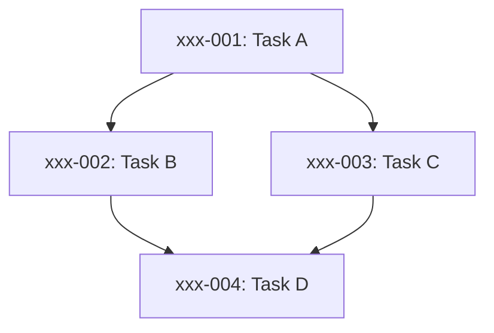

# Session Plan Template

Use this template for planning multi-agent orchestration sessions.

## Session Overview

**Date:** YYYY-MM-DD
**Queen:** Claude Opus
**User Request:** [Paste original request here]
**Task IDs:** [List all task IDs]
**Epic:** [If applicable]

---

## Pre-Flight Analysis

### Task Metadata Summary

| Task ID | Title | Files Modified | Priority | Depends On | Blocks |
|---------|-------|----------------|----------|------------|--------|
| xxx-001 | Description | file.py | P1 | - | xxx-002 |
| xxx-002 | Description | file.py, test.py | P2 | xxx-001 | - |
| ... | ... | ... | ... | ... | ... |

### File Conflict Matrix

```
build.py: [xxx-001, xxx-002, xxx-005]       → 3 tasks (CONFLICT RISK)
site.yaml: [xxx-003, xxx-004]               → 2 tasks (manageable)
templates/index.html: [xxx-006]             → 1 task (no conflict)
```

### Dependency Graph



### Conflict Risk Assessment

- 🔴 **HIGH RISK:** build.py (3 tasks, overlapping sections)
- 🟡 **MEDIUM RISK:** site.yaml (2 tasks, schema change + usage)
- 🟢 **LOW RISK:** templates (independent files)

---

## Execution Strategy

### Option A: Maximum Safety (Serial)

**Approach:** Sequential execution, batched by file

**Agent Groups:**
1. **build.py group** (3 tasks: xxx-001, xxx-002, xxx-005)
   - Agent: python-pro
   - Execution: Sequential within agent
   - Estimated time: 45 min

2. **site.yaml group** (2 tasks: xxx-003, xxx-004)
   - Agent: refactoring-specialist
   - Execution: Sequential within agent
   - Estimated time: 20 min

3. **templates group** (1 task: xxx-006)
   - Agent: refactoring-specialist
   - Execution: Immediate
   - Estimated time: 15 min

**Total estimated time:** 80 minutes
**Conflict risk:** 🟢 Very Low
**Parallelization:** Minimal (only independent files)

### Option B: Balanced (Recommended)

**Approach:** Parallel where safe, serial where risky

**Wave 1 (Parallel):**
- Agent 1: xxx-001 (build.py - foundational change)
- Agent 2: xxx-003 (site.yaml - schema change)
- Agent 3: xxx-006 (templates - independent)

**Wave 2 (After Wave 1 completes):**
- Agent 4: xxx-002, xxx-005 (build.py - depends on xxx-001)
- Agent 5: xxx-004 (site.yaml - depends on xxx-003)

**Total estimated time:** 35-45 minutes
**Conflict risk:** 🟡 Low-Medium (managed via dependencies)
**Parallelization:** High (3 agents → 2 agents)

### Option C: Maximum Speed (Parallel + Rebase)

**Approach:** All parallel, let git rebase handle conflicts

**All at once:**
- Agent 1: xxx-001 (build.py validation)
- Agent 2: xxx-002 (build.py error handling)
- Agent 3: xxx-005 (build.py idempotency)
- Agent 4: xxx-003, xxx-004 (site.yaml batched)
- Agent 5: xxx-006 (templates)

**Total estimated time:** 20-30 minutes
**Conflict risk:** 🟡 Medium (multiple agents → build.py)
**Parallelization:** Maximum (5 concurrent agents)
**Requires:** Experienced with git rebase conflict resolution

---

## User Approval Checkpoint

**Present to user:**

> I analyzed the 6 tasks you requested. Here's what I found:
>
> **Conflict Analysis:**
> - 3 tasks modify build.py (potential conflicts)
> - 2 tasks modify site.yaml (manageable)
> - 1 task modifies templates (no conflicts)
>
> **I recommend Option B (Balanced):**
> - Wave 1: 3 agents in parallel (foundational changes)
> - Wave 2: 2 agents after Wave 1 (dependent changes)
> - Estimated time: 35-45 minutes
> - Conflict risk: Low-Medium (managed via dependencies)
>
> Alternative options:
> - Option A: Serial execution (safer, 80 min)
> - Option C: Full parallel (faster, 20-30 min, higher conflict risk)
>
> Which strategy would you prefer?

**Wait for user response before spawning agents.**

---

## Execution Plan (Selected Strategy)

**Strategy chosen:** [Option A / B / C]

### Agent Spawn Sequence

#### Wave 1: [Name]

```python
spawn(
    subagent_type='python-pro',
    description='xxx-001: Task description',
    tasks=['xxx-001'],
    files=['build.py'],
    background=True,
)

spawn(
    subagent_type='refactoring-specialist',
    description='xxx-003: Task description',
    tasks=['xxx-003'],
    files=['site.yaml'],
    background=True,
)

# ... more agents
```

**Monitor:** TaskCreate for each agent

#### Wave 2: [Name]

**Trigger:** After Wave 1 completes
**Dependencies:** xxx-001, xxx-003 must be committed

```python
# Wait for Wave 1 completion
await_all_complete(wave_1_agents)

# Check for conflicts
verify_no_conflicts()

# Spawn Wave 2
spawn(
    subagent_type='python-pro',
    description='xxx-002, xxx-005: Batched build.py tasks',
    tasks=['xxx-002', 'xxx-005'],
    files=['build.py'],
    background=True,
)
```

---

## Quality Review Plan

After all implementation agents complete:

### Review Wave (Parallel TeamCreate)

Reviews run as a single parallel Nitpicker team spawned via TeamCreate (per RULES-review.md Step 3b).

**Round 1 team composition (6 members):**
- 4 Nitpicker reviewers (Clarity, Edge Cases, Correctness, Drift) — run concurrently
- 1 Big Head (deduplication, root-cause grouping, issue filing)
- 1 Checkpoint Auditor (review-integrity verification — added as team member so the Review Consolidator can SendMessage to it)

**Round 2+ team composition (4 members):**
- 2 Nitpicker reviewers (Correctness + Edge Cases only)
- 1 Big Head
- 1 Pest Control

**Pre-spawn gate:** pre-spawn-check must PASS before the reviewer team is spawned.

**Output:** Big Head consolidated summary written to `${SESSION_DIR}/review-reports/review-consolidated-{timestamp}.md`

### Review Follow-Up Decision

Per RULES-review.md Step 3c — triage is root-cause-based, not raw-issue-count-based:

**If zero P1 and zero P2 findings:** Proceed directly to Step 4 (documentation — README and CLAUDE.md only).
The Scribe authors the session CHANGELOG at Step 5.

**Auto-fix (round 1, <=10 root causes):** Spawn fix tasks automatically without user prompt. After fixes, re-run reviews at round N+1.

**Escalation (round 1, >10 root causes):** Present findings to user. Await "fix now" or "defer" decision.

**Round 2+:** Present findings to user. Await "fix now" or "defer" decision.

**Round cap:** If current round >= 4 and P1/P2 findings are still present, do NOT start another round — present full round history and await explicit user decision.

See RULES-review.md Step 3c for the complete triage decision tree including session-state update requirements and progress log entries.

---

## Documentation Plan

Files to update after all work completes:

- [ ] **CHANGELOG.md** - Authored by the Scribe at Step 5 (not the Queen at Step 4)
  - Scribe derives entries from exec-summary.md: task descriptions, bug fix summaries, new features, breaking changes
  - Queen commits the Scribe's CHANGELOG.md output at Step 7 before pushing

- [ ] **README.md** - Update if needed
  - New scripts or tools
  - New directory structure
  - New dependencies
  - Usage examples changed

- [ ] **CLAUDE.md** - Update if needed
  - Architecture changes
  - New file locations
  - Process changes
  - Important decisions

- [ ] **Other docs** - Project-specific
  - API docs
  - User guides
  - Configuration examples

**Single commit:** `docs: update documentation for [session summary]`

---

## Landing the Plane Checklist

Before declaring session complete:

### Pre-Push Verification

- [ ] All spawned agents completed (none stuck/errored)
- [ ] All TaskCreate entries marked completed
- [ ] All crumbs tasks closed (crumb close <ids>)
- [ ] Git working tree clean (git status)
- [ ] Build/test quality gates passed
  - [ ] `python build.py --dry-run` succeeds
  - [ ] `pytest tests/` passes (if tests exist)
  - [ ] Linter passes (if configured)
- [ ] session-complete PASS (Step 6) — Exec Summary Verification passed before git push

### Documentation Complete

- [ ] CHANGELOG.md authored by Scribe (Step 5) and committed by Queen (Step 7)
- [ ] README.md updated (if needed)
- [ ] CLAUDE.md updated (if needed)
- [ ] All cross-references verified (no broken links)

### Git Operations

- [ ] `git pull --rebase` (check for remote changes)
- [ ] `git push` (MANDATORY - not done until pushed!)
- [ ] `git status` shows "up to date with origin/main"

### Handoff

- [ ] Session summary created
- [ ] Commit list documented
- [ ] New crumbs filed (if any remain open)
- [ ] Context for next session provided

---

## Session Metrics (Track These)

**Efficiency Metrics:**
- Tasks completed: ___ / ___
- Agents spawned: ___
- Commits created: ___
- Time elapsed: ___ minutes
- Token budget used: ___K / 1M (___%)

**Quality Metrics:**
- P1 bugs filed: ___
- P2 bugs filed: ___
- P3 improvements filed: ___
- Test coverage: ___% (if applicable)
- Build success: ✅ / ❌

**Conflict Metrics:**
- Merge conflicts encountered: ___
- Conflicts resolved: ___
- Commits rebased: ___
- Strategy changes mid-session: ___

**Context Preservation:**
- Implementation files read in Queen window: ___ (target: <10)
- Token budget remaining: ___K (target: >100K)
- Queen stayed focused: ✅ / ❌

---

## Lessons Learned

**What worked well:**
- [Document successful patterns]

**What could improve:**
- [Document pain points and ideas]

**For next session:**
- [Action items and improvements]

---

## Template Usage Instructions

1. **Copy this template** at start of session
2. **Fill out Pre-Flight Analysis** after gathering task metadata
3. **Present Execution Strategy options** to user
4. **Wait for approval** before spawning agents
5. **Update in real-time** as session progresses
6. **Complete metrics** at end of session
7. **Archive** in session-notes/ directory for future reference
